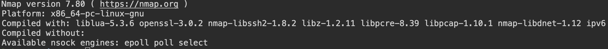
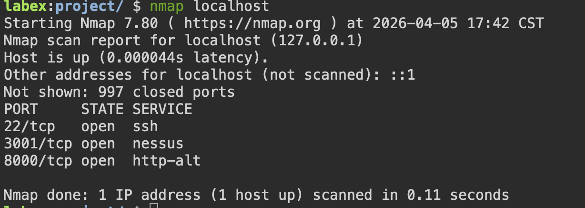
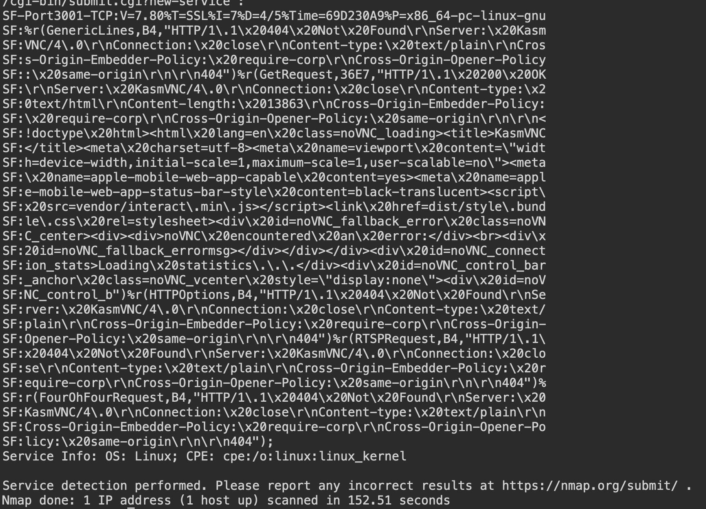

# Basic Vulnerability Scanning with Nmap

## Objective
The goal of this lab was to learn how to use Nmap for basic vulnerability scanning. This included installing Nmap, scanning my machine, and then interpreting the results to understand what might be exposed.

---

## Installing Nmap on Ubuntu 22.04

Before doing anything, I needed to install Nmap using the `apt` package manager.

### 1. Update Package List

```bash
sudo apt update
This makes sure everything is up to date before installing anything

### 2. Install Nmap

sudo apt install -y nmap
The -y just skips the confirmation step so installs straight away.

### 3. Verify Installation

nmap --version
I used this to check that Nmap installed properly.



## What I learned from Installation
How to install tools using apt
Why updating packages first is important
How to check if something installed correctly

##Performing a Localhost Port Scan
Next, I ran a basic scan using Localhost
I learned that a port scan basically checks for open "doors" on your system where services are running.

### 4. Run the Scan

nmap localhost

Scan Results
This showed me which ports were open and what services were running.



## Interpreting the results
from the output:

PORT - the port number
STATE - whether it's open
SERVICE - what's running on that port

## Key Findings

Port 22 - SSH (used for remote access)
Port 3001 - Nessus
Port 8000 - Web service

These ports are open and actively running services.

## What I learned from Port Scanning

How to run a basic scan using Nmap
How to identify open ports
That open ports can be potential entry points if not secured

## Version Detection and Vulnerability Analysis

After that, I wanted more detail about what exactly was running on those ports.

### Run Version Scan

nmap -sV localhost



### Scan Results
This gave me more detailed information, including the actual software and versions.

## Interpreting the results

The main thing here is the VERSION column.
This shows the exact software running, not just the service name.
for example : Port 8000 - SimpleHTTPServer 0.6 (Python3.10.12)

## Identifying Potential Vulnerabilities

An open port itself is not a vulnerability
The real risk comes from:
outdated software
misconfigured services
known vulnerabilities linked to specific versions

With this information, vulnerabilities can be researched further.

## What I learned from Version Scanning

How to use -sV to get more detailed information
Why version detection is important in security
How vulnerability scanning works in practice

## Real-World Application

This is how security professionals begin assessing a system. They scan for open ports, identify services, and then check whether any of those services are vulnerable.

---

*** Conclusion 

In this lab, I learned how to:
Install Nmap using apt
Scan my machine for open ports
Use version detection (-sV)
Interpret results to understand potential risks

Overall, this gave me a solid introduction to network scanning and basic vulnerability analysis.
