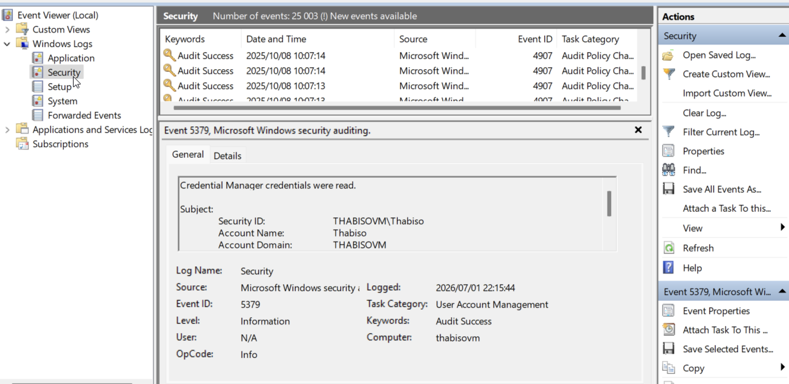
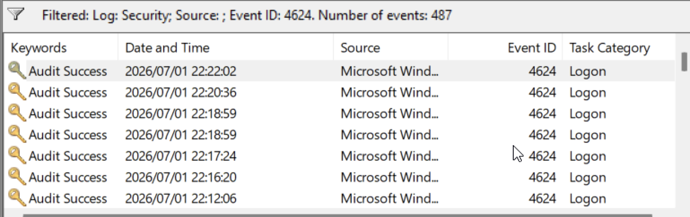
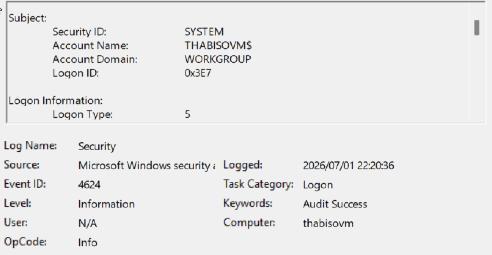
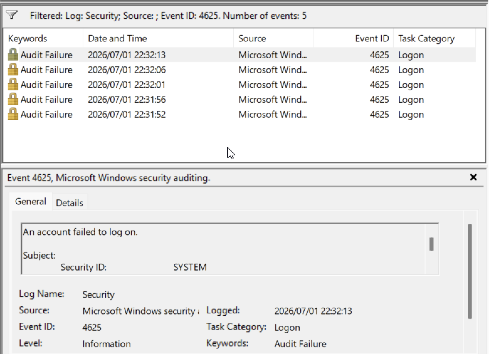
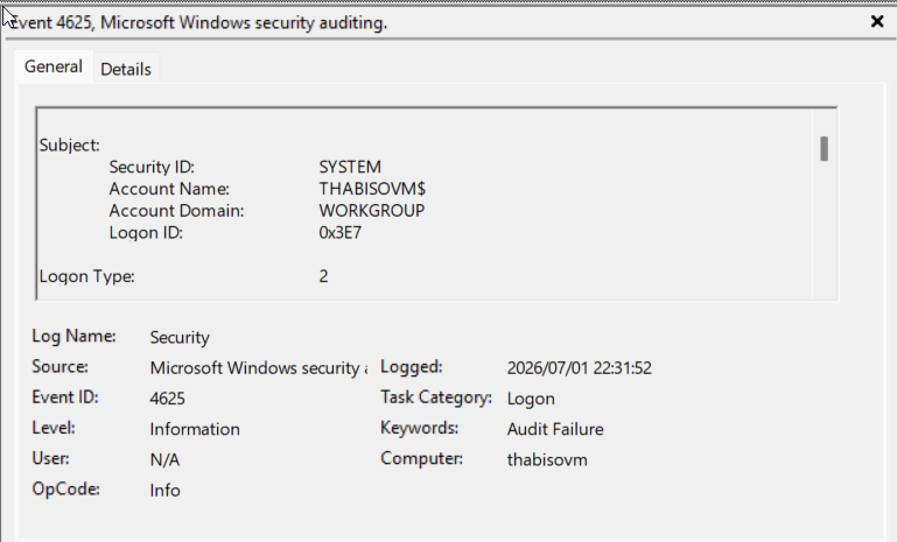
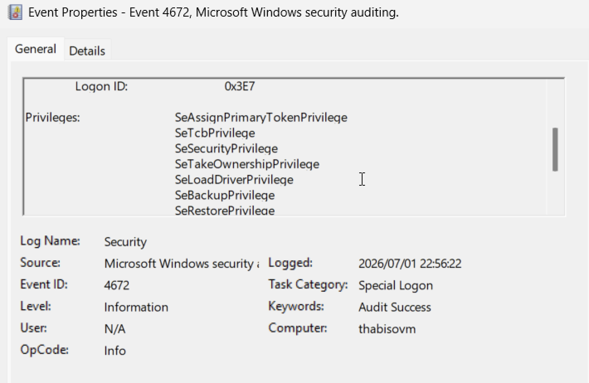

# Windows Logon Investigation

## Objective

The objective of this investigation was to analyse Windows authentication events using Windows Event Viewer. By reviewing Windows Security logs, I identified successful logons, failed logons, and privileged account activity while documenting the investigation using a structured SOC analyst workflow.

---

## Lab Environment

| Component | Details |
|-----------|---------|
| Operating System | Windows 11 |
| Platform | UTM Virtual Machine |
| Log Source | Windows Security Log |
| Investigation Tool | Windows Event Viewer |

---

## Tools Used

- Windows Event Viewer
- Windows Security Logs

---

## Event IDs Investigated

| Event ID | Description |
|----------|-------------|
| 4624 | Successful Logon |
| 4625 | Failed Logon |
| 4672 | Special Privileges Assigned to New Logon |

---

## Investigation Steps

1. Opened Windows Event Viewer.
2. Navigated to **Windows Logs → Security**.
3. Reviewed authentication events within the Security log.
4. Filtered events using Event IDs **4624**, **4625**, and **4672**.
5. Generated failed logon events by intentionally entering an incorrect password.
6. Analysed authentication activity and documented the findings.

---

# Investigation Evidence

## 1. Windows Security Log Overview

### Description

Opened the Windows Security log to review authentication-related events generated by the operating system.

### Evidence

### Analysis

The Security log contained thousands of Windows authentication events that could be filtered using specific Event IDs. This log serves as one of the primary data sources for authentication investigations.

### SOC Relevance

Windows Security logs provide visibility into authentication activity, privilege assignments, account management, and other security-related events.

---

## 2. Event ID 4624 – Successful Logons

### Description

Filtered the Security log using **Event ID 4624** to identify successful authentication events.

### Evidence

### Analysis

Multiple successful logon events were identified. The investigation confirmed that Windows records each successful authentication together with the associated user account, logon type, and timestamp.

### SOC Relevance

SOC analysts review successful logons to establish a baseline of normal authentication activity and correlate them with other security events during investigations.

---

## 3. Event ID 4624 – Event Details

### Description

Reviewed the details of an individual successful logon event.

### Evidence

### Analysis

The following fields were reviewed:

- Account Name
- Security ID
- Logon Type
- Time Created
- Computer Name

These fields help determine who authenticated, when the authentication occurred, and how the logon was performed.

### SOC Relevance

Successful authentication events are commonly reviewed during incident investigations to verify legitimate user access.

---

## 4. Event ID 4625 – Failed Logons

### Description

Generated failed authentication events by intentionally entering an incorrect password.

### Evidence

### Analysis

The failed authentication attempts were successfully recorded in the Windows Security log after multiple incorrect password attempts.

### SOC Relevance

Repeated failed authentication attempts may indicate password spraying, brute-force attacks, or compromised credentials.

---

## 5. Event ID 4625 – Event Details

### Description

Reviewed the details of a failed authentication event.

### Evidence

### Analysis

The investigation focused on the following fields:

- Account Name
- Failure Reason
- Status Code
- Sub-Status Code
- Logon Type
- Time Created

These fields explain why authentication failed and provide valuable context during investigations.

### SOC Relevance

SOC analysts use failed authentication events to identify suspicious login attempts and determine whether further investigation is required.

---

## 6. Event ID 4672 – Privileged Logons

### Description

Filtered the Security log using **Event ID 4672** to identify privileged authentication events.

### Analysis

The Security log recorded events where accounts were assigned elevated privileges following successful authentication.

### SOC Relevance

Unexpected privileged logons should always be reviewed because they may indicate administrator activity or privilege misuse.

---

## 7. Event ID 4672 – Event Details

### Description

Reviewed the details of a privileged logon event.

### Evidence

### Analysis

The event identified the account that received elevated privileges after authentication and listed the privileges assigned.

### SOC Relevance

Monitoring privileged authentication activity helps identify unauthorized administrative access and supports privilege monitoring.

---

## Key Findings

- Successfully investigated Windows Security authentication events.
- Identified successful logon activity using Event ID 4624.
- Generated and analysed failed logon events using Event ID 4625.
- Reviewed privileged authentication activity using Event ID 4672.
- Practised analysing authentication logs using Windows Event Viewer.

---

## Skills Demonstrated

- Windows Event Viewer
- Windows Security Log Analysis
- Authentication Event Investigation
- Security Event Analysis
- Basic SOC Alert Triage
- Technical Documentation

---

## MITRE ATT&CK Mapping

| Technique | ATT&CK ID |
|------------|-----------|
| Valid Accounts | T1078 |
| Brute Force | T1110 |

---

## Conclusion

This investigation provided practical experience analysing Windows authentication events using Windows Event Viewer. By reviewing successful logons, failed logons, and privileged account activity, I developed foundational SOC skills in authentication monitoring, security log analysis, evidence collection, and technical documentation.
