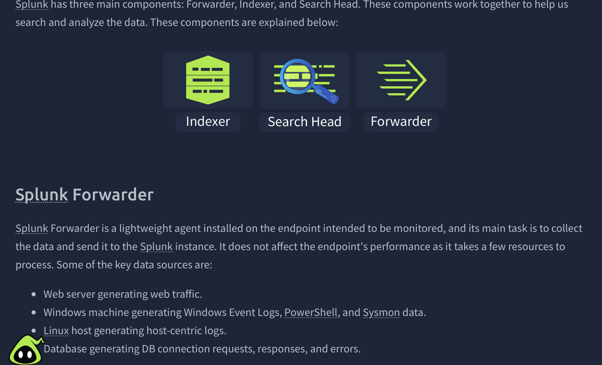
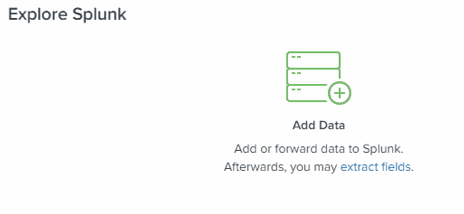
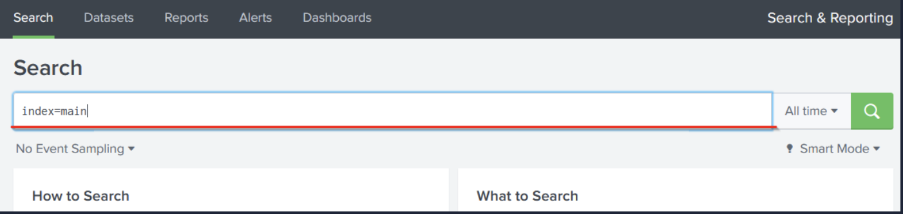
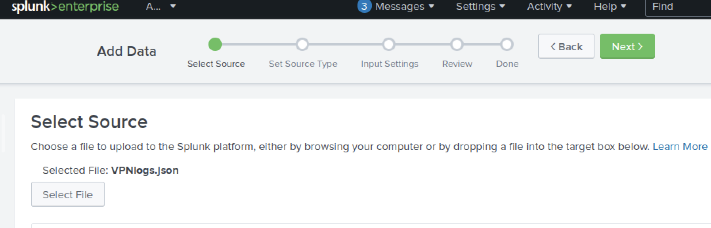
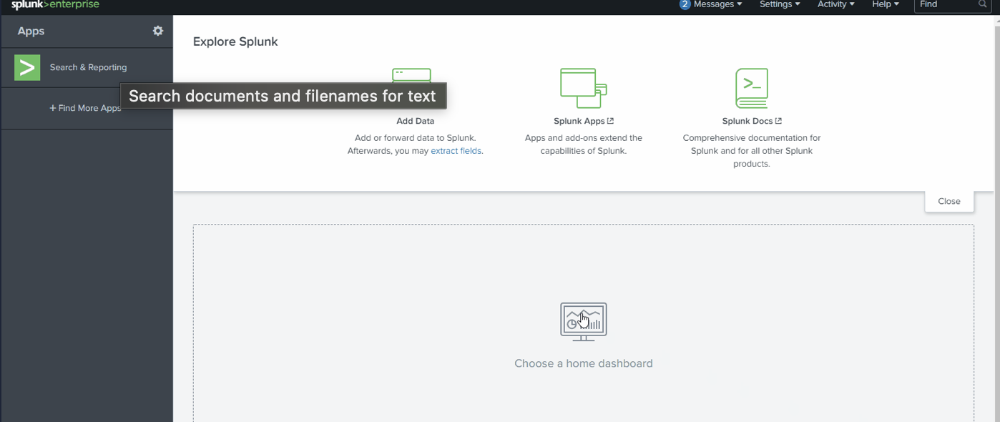

# Splunk Basic Lab (TryHackMe)

## Objective

The objective of this lab was to understand Splunk's core architecture and gain hands-on experience importing logs, searching indexed events, and using dashboards for log analysis.

---

# Lab Overview

During this lab I explored:

- Splunk Forwarders
- Splunk Indexers
- Search Heads
- Data Ingestion
- Search Processing Language (SPL)
- Dashboards and Visualisations

---

# Splunk Architecture

## Forwarder

The Splunk Forwarder is installed on monitored endpoints and securely forwards log data to the Splunk Indexer.

Common log sources include:

- Windows Event Logs
- Sysmon
- PowerShell
- Linux Logs
- Web Server Logs
- Database Logs

---

## Indexer

The Indexer receives logs from Forwarders.

Its responsibilities include:

- Parsing data
- Indexing events
- Storing searchable logs
- Organising field-value pairs

---

## Search Head

The Search Head provides the interface used by analysts to:

- Search indexed logs
- Run SPL queries
- Investigate events
- Build reports
- Create dashboards

---

# Data Ingestion

Imported the provided VPNLogs.json dataset into Splunk using the Add Data wizard.

Process followed:

1. Selected data source
2. Confirmed source type
3. Reviewed input settings
4. Indexed the data

---

# Searching Events

Example SPL search:

```spl
source="VPNLogs.json"
```

Filtering by host:

```spl
source="VPNLogs.json" host="VPN_Connections"
```

---

# Dashboards

Explored Splunk visualisations including:

- Tables
- Event Timeline
- Statistics
- Column Charts
- Pie Charts

---

# SOC Skills Demonstrated

This lab demonstrates practical knowledge of:

- SIEM navigation
- Log ingestion
- Event searching
- Basic SPL
- Security log investigation
- Dashboard visualisation

---

# Screenshots

## Splunk Components



---

## Importing Logs



---

## Searching Events



---

## VPN Log Investigation



---

## Dashboard



---

# Key Takeaways

Through this lab I gained hands-on experience with the Splunk data pipeline:

Forwarder → Indexer → Search Head

I also learned how to import log data, perform searches using SPL, investigate events, and visualise data using dashboards.
