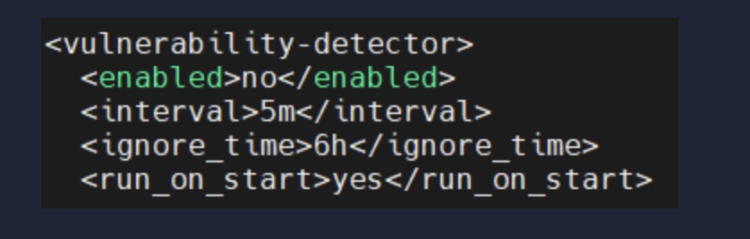
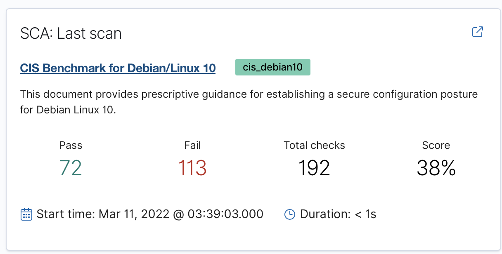
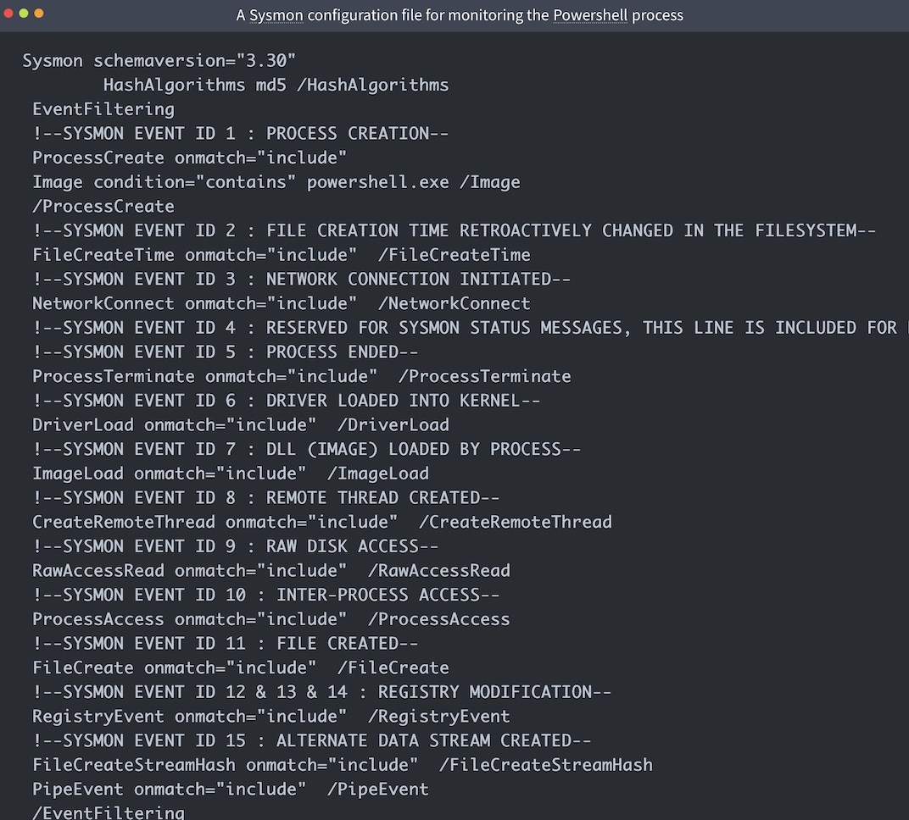
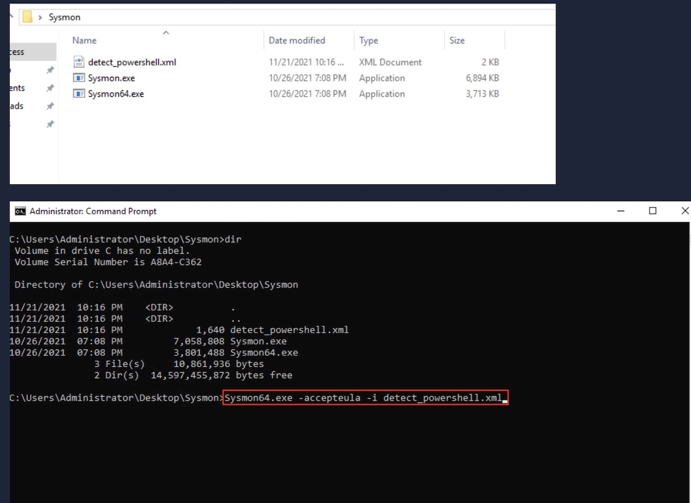
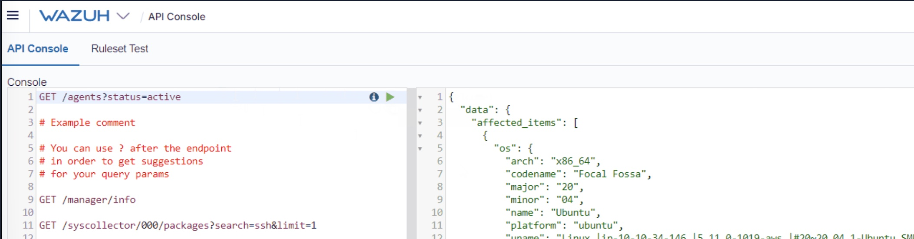

# Wazuh Labs

This section contains my Wazuh SIEM and XDR learning labs, notes, and investigations.

# Wazuh SIEM & XDR Lab

## Objective

This lab demonstrates the deployment and use of Wazuh for:

- Vulnerability Detection
- Security Configuration Assessment (SCA)
- Sysmon Integration
- Process Monitoring
- PowerShell Detection
- API Queries and Alert Investigation

---

## Environment

| Component | Description |
|------------|-------------|
| Wazuh Manager | Centralized SIEM |
| Windows Endpoint | Monitored host |
| Sysmon | Endpoint telemetry |
| Wazuh Agent | Log forwarding |

---

## Skills Demonstrated

- SIEM Administration
- Log Analysis
- Endpoint Monitoring
- Threat Detection
- Vulnerability Management
- Security Compliance Monitoring

---

## Lab Tasks

### 1. Vulnerability Detection

Configured the Wazuh Vulnerability Detector module to identify vulnerable software and operating system packages.

Screenshot:

---

### 2. Security Configuration Assessment

Performed CIS benchmark checks and reviewed compliance results.

Screenshot:

---

### 3. Sysmon Integration

Configured Sysmon to generate enhanced Windows security telemetry.

Events monitored:

- Process Creation
- Network Connections
- Registry Changes
- Image Loads
- Named Pipes

Screenshot:

---

### 4. PowerShell Monitoring

Created monitoring rules to detect PowerShell execution activity.

MITRE ATT&CK:

- T1059.001 PowerShell

Screenshot:

---

### 5. API Queries

Used the Wazuh API to retrieve alert information and security events.

Screenshot:

---

## Key Takeaways

- Learned Wazuh architecture and agent management
- Investigated endpoint activity through Sysmon logs
- Identified system vulnerabilities
- Reviewed CIS benchmark compliance
- Queried alerts through the Wazuh API
